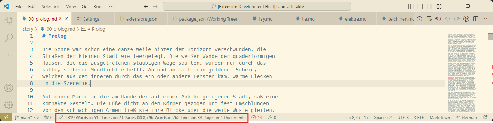

# VSCode - PageCount README
 
This is based on the WordCount sample extension

## Functionality

This extension provides a simple, automatic word count feature for text files, with a default activation on `*.md` files (can be changed). The word count, line count and an estimated page count (calculated based on a configurable setting) will be displayed in the status bar and updated in real-time.

Additionally, it shows these stats across all files.

You can configure which file types to track for word count and exclude specific files or directories (e.g., node_modules is excluded by default). Opening a file that is excluded will still show the stats, but will not include those in the total. 

The page estimation can be adjusted based on either word count or line count, with both `pagecount.pagesizeInWords` and `pagecount.pagesizeInLines` settings available for customization.

## What it doesn't do

This extension works with plain text and does not interpret Markdown syntax. It will count items like dashes from lists and `#` from headings as words. Similarly, frontmatter lines and words will also be included in the word count.

In the future, Markdown parsing (e.g., using remark) may be added, but for now, this is beyond the scope of the extension. However, pull requests are welcome if you'd like to contribute and implement this feature!